<h1 align="center">Hi 👋, I'm Zeeshan Ali</h1>
<h3 align="center">A dedicated Full Stack Web/Mobile App Developer, Cloud Practitioner, Generative AI , Langchain and Dapps Developer from Pakistan.</h3>
<!-- Add Views badge -->

  

  
  
  

###

<h3 align="left">👩‍💻  About Me</h3>

###

 🔭 I’m working as Software Engineer @ P2PClouds and Web Instructor @ NexSkill PVT LTD... - 📚 I'm currently learning different emerging technologies... - ⚡ In my free time I do my learnings

###

</img> 

  

- 📫 How to reach me **zeeshanali90233@gmail.com**

### Blogs posts
<!-- BLOG-POST-LIST:START -->
<!-- BLOG-POST-LIST:END -->

<h3 align="left">Connect with me:</h3>

<h3 align="left">Languages and Tools:</h3>

  <!-- Current Tools -->
  
  
  
  
  
  
  
  
  
  
  
  
  

  <!-- Additional Tools -->
  
  
  
  
  
  
  
  
  
  
  
  

 

  
  

  

           

            

 
